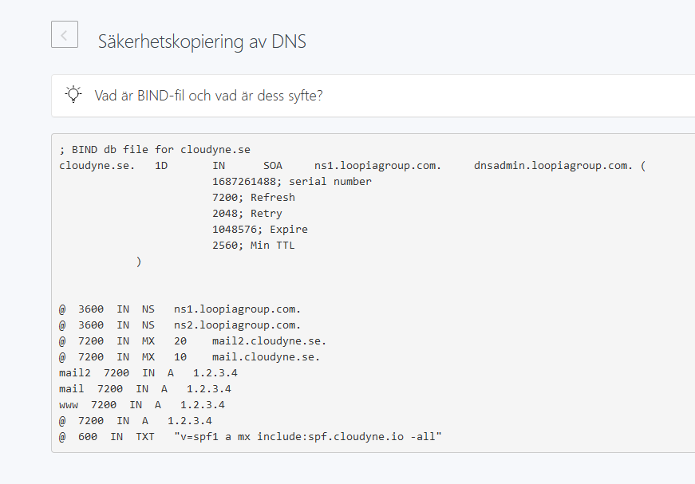

# Point your domain to our services
If you would rather hang on to your domain, or have it as part of another service, you can point the settings for that domain so that it uses our name servers, and thereby is fully integrated with our services.

If you would rather have us take over management and renewal of the domain, check out our [domain transfer guide](/domains/transfer-domain).

This is going to vary slightly depending on which registrar you are using, we have some general examples below

## Send us your Zone File

To be able to set up your domain with us, we need a copy of what is called the DNS Zone. This enables us to set up the domain in the same way as it is currently set up with your current provider, without any interruptions or downtime.

::: tip
If you are having trouble identifying where to search for these settings, you can go to https://whois.loopia.se and type in your domain name. In the text, in an entry called "Registrar" is your current provider.
:::

### Loopia
::: details

1. Log in to your account at [loopia.se](https://loopia.se) and click on your domain in the listing   
2. Open the DNS-editor  
3. At the bottom, click "Exportera"  
4. A file will then download to your computer. Send us this file via email, or upload it to our support system. 
:::

### Websupport
::: details
1. Log into your account at [websupport.se](https://auth.websupport.se/?s=cart&l=sv&c=websupport.se) and go to my services/mina tjänster 

2. Click on the domain/Domäner-tab and then click on your domain 
3. Choose DNS and then BIND Export/BIND filexport in the menu to the left 
4. Copy the content, or click "Ladda ned i .txt-format" and send us the information via email or support system 
:::

### One.com
::: details
For one.com, you need to contact the support and ask them to provide you with a copy of your DNS zone. You can use the following template:

Hi! I'd like a copy of all of the records in my DNS zone since I'm changing nameservers and would like to keep everything intact. Could you email me this?
:::

### FSData (Misshosting)
::: details
Contact us for detailed instructions
:::

### Oderland
::: details
Contact us for detailed instructions
https://www.oderland.se/support/en/artikel/how-do-i-export-a-zone-file-for-my-domain/
:::

## Change your Name Servers
When you have received confirmation from us that the setup is finished, you can now proceed to change your name servers. Guides for the most popular providers are listed below

::: danger
Do not change your name servers to ours before we have confirmed that the setup is finished. If you change them before the configuration is in place, your domain and all associated services (website, email, etc.) will stop working.
:::

::: info
Our name servers are:
- **ns1.cloudyne.io** IP: 162.159.8.240 IPv6: 2400:cb00:2049:1::a29f:8f0
- **ns2.cloudyne.io** IP: 162.159.9.243 IPv6: 2400:cb00:2049:1::a29f:9f3
- **ns3.cloudyne.io** IP: 162.159.11.63 IPv6: 2400:cb00:2049:1::a29f:b3f
- **ns4.cloudyne.io** IP: 198.41.222.151 IPv6: 2400:cb00:2049:1::c629:de97
:::

### Loopia
::: details
1. Log in to your account and click on your domain in the listing   
2. Click on "Namnservrar"  
3. Fill in our nameservers and click "Byt namnservrar"  
4. The changes take approximately 24 hours to take effect
:::

### Websupport
::: details
1. Log into your account at [websupport.se](https://auth.websupport.se/?s=cart&l=sv&c=websupport.se) and go to my services/mina tjänster 
2. Click on the domain/Domäner-tab and then click on your domain 
3. Click DNS and Namnservrar in the menu to the left 
4. If DNSSEC is active, contact us to receive a new set of DNSSEC keys. Then, go to DNS and DNSSEC in the menu to the left and click on "Lägg till DNSSEC-record" 
5. Fill in the information you received from us and click "Spara Ändringar" 
6. Click DNS and Namnservrar in the menu to the left. Click "Anpassad namnserver", Uncheck the "Aktivera GLUE-pekare" switch if it is active, and fill in our nameservers and then click "Anpassat" to save the changes. 
7. The changes take approximately 24 hours to take effect
:::

### One.com
::: details
You can use the following one.com article as a reference. Use the nameservers above (ns1-ns4.cloudyne.io)
https://help.one.com/hc/en-us/articles/360000841638-How-do-I-change-the-name-servers

If you have DNSSEC enabled, please contact us before and we can send you further instructions.
:::

### FSData (Misshosting)
::: details
You can use the following article as a reference on how to change nameservers

https://misshosting.help/sv/articles/1879361-hur-andrar-jag-mina-namnservrar

If you have DNSSEC enabled, please contact us before and we can send you further instructions.
:::

### Oderland
::: details
https://www.oderland.se/support/en/artikel/how-do-i-change-the-nameservers-that-my-domain-is-using/
:::

