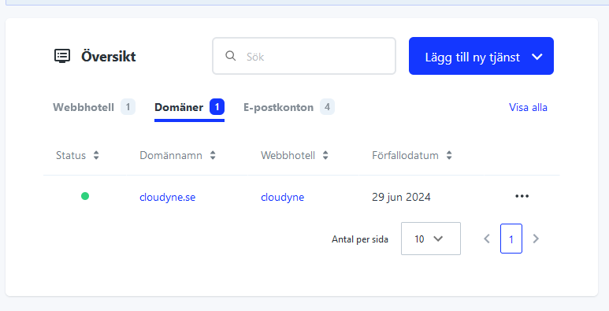

# Transfer a domain to us
To transfer your domain to us, you can do this one of two ways:

1. Export a BIND file from your current host, generate an EPP code and send both to us
2. Provide us with login information to your current registrar/webhost and we can handle the transfer for you

To export a BIND file, see the instructions under "Change Nameservers" in the menu to the left for how to export a bind file for your host.

## Getting the EPP auth code
The auth code enables you to move your domain from one registrar to an other. This is a security measure to prevent unauthorized transfers of domains. The code is unique to each domain and is valid for 60 days.

### Loopia
::: details

1. Log in to your account at [loopia.se](https://loopia.se) and click on your domain in the listing   
2. Click on "Transfer av domännamn"  
3. You will receive a transfer code. Copy this code and send it to us
:::

### Websupport
::: details
1. Log into your account at [websupport.se](https://auth.websupport.se/?s=cart&l=sv&c=websupport.se) and go to my services/mina tjänster 

2. Click on the domain/Domäner-tab and then click on your domain 
3. Click on the "Hämta Auktoriseringskod", copy the code and send it to us 
:::

### One.com
::: details
Get the code according to the instructions on https://help.one.com/hc/en-us/articles/14537316791825-Where-do-I-find-my-Auth-ID-EPP-code
and then send it to us
:::

### FSData (Misshosting)
::: details
Get the code according to the instructions on https://misshosting.help/en/articles/6836656-how-to-move-a-domain-from-miss-hosting-to-another-registrar and then send it to us
:::

### Oderland
::: details
Get the code according to the instructions on https://www.oderland.se/support/en/artikel/where-can-i-find-an-epp-code-for-my-domain/ and send it to us
:::
