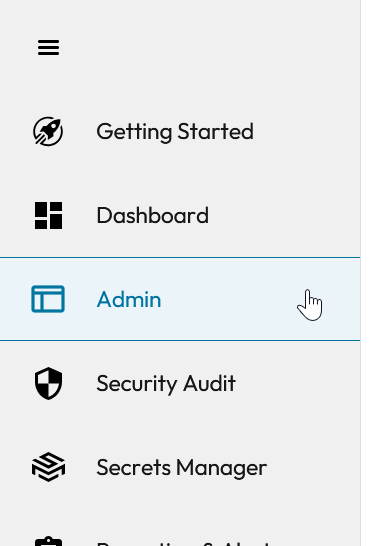
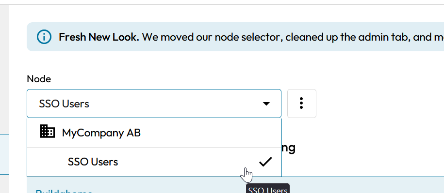
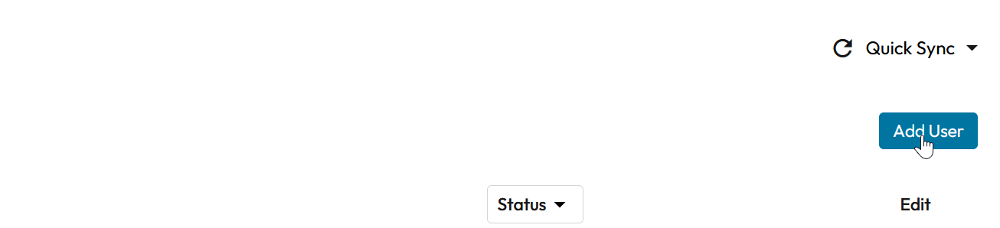
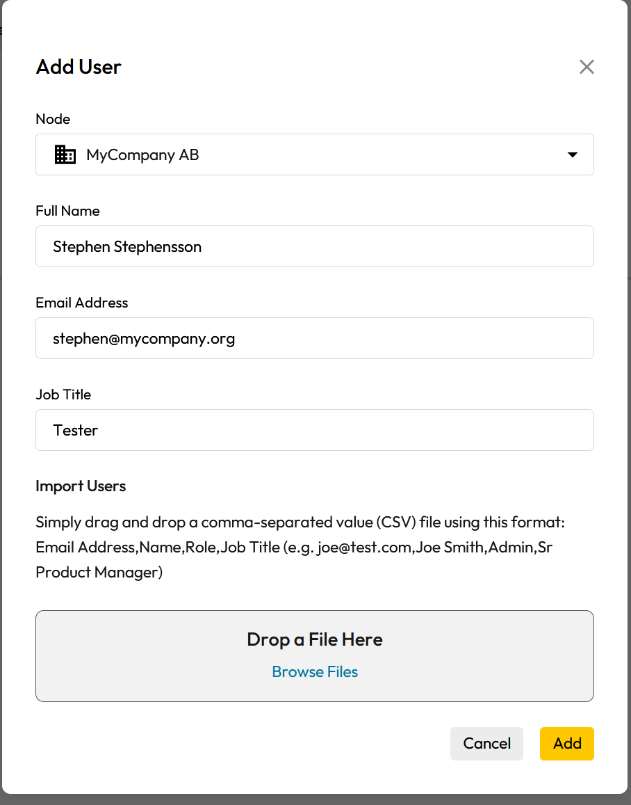

## Add users with Keeper SSO (Administrator)
If you do not have the automatic provisioning enabled, you need to add any users that are to log in manually. To do this, start by going to the Keeper Admin Console and logging in

::: info
If you do not have access to the Keeper Admin Console, please contact your Keeper administrator.
You'll find the console here: [https://keepersecurity.eu/console](https://keepersecurity.eu/console)
:::

Once logged in, click on the "Admin" section in the menu

Ensure you have chosen the SSO Users node in the dropdown at the top

Click on the "Add User" button

Fill in the details, and then click "Add". The user will receive an email with instructions on how to log in.

When the user has logged in for the first time, you can add them to any groups and roles they should be in.