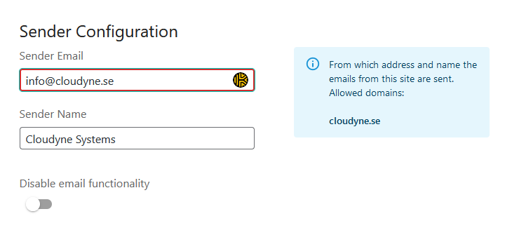
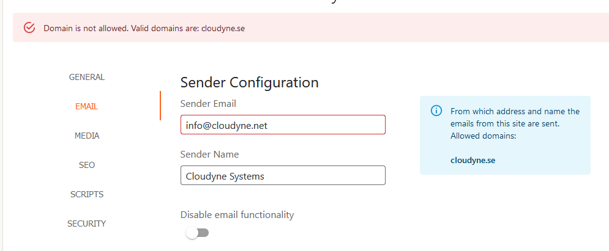
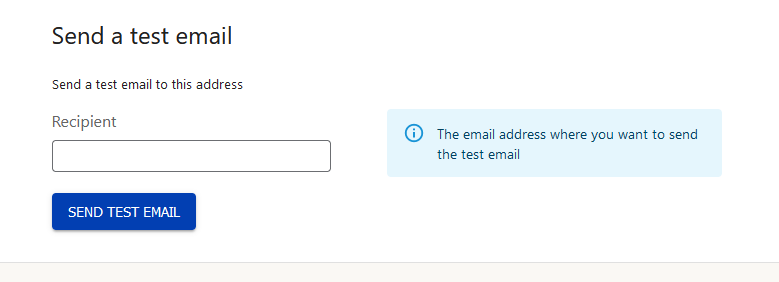

## Sending emails from your Wordpress site
You can configure your email settings in the Wordyne section in the sidebar. For the email to work, you have to enable the SMTP service for your domain (see [SMTP Service](/domains/smtp-service)).

### Configuration

Sender Email: The email your site will send emails from. Any other settings made in other plugins will be overridden by this setting.
Sender Name: The name that shows up on the email
Disable Email Functionality: Disable our SMTP service and use another plugin to send your emails (e.g. MailGun, SendGrid, etc.)

Allowed Domains: The domains that have been validated for your account to send emails from. If you have multiple validated domains, all of them will show up here. To validate additional domains, visit the control panel.

If you try to change your sender email to a domain that is not verified, you will receive an error message:

You can use the box at the bottom to send a test email with your settings to verify that everything is working

