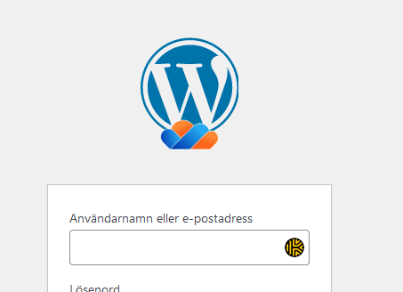
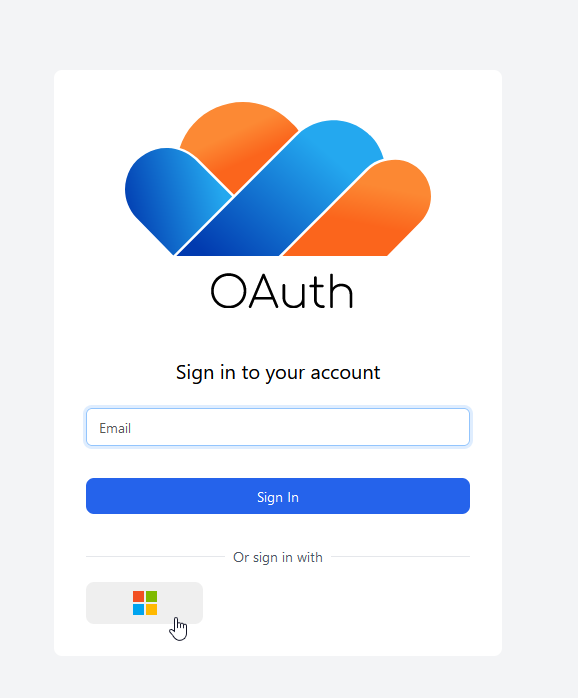
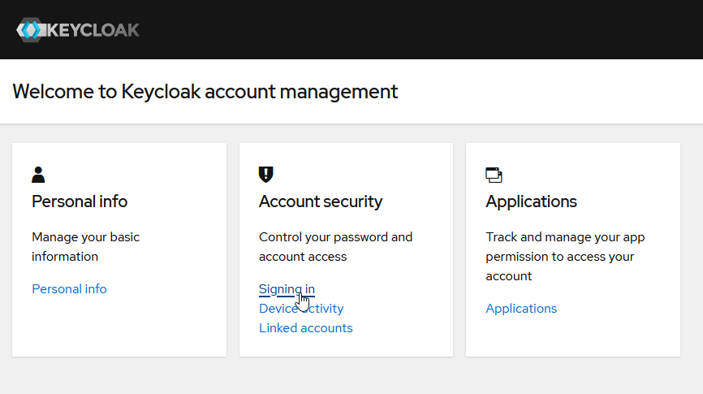
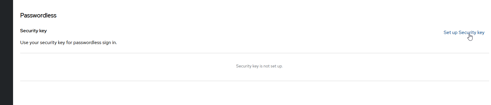
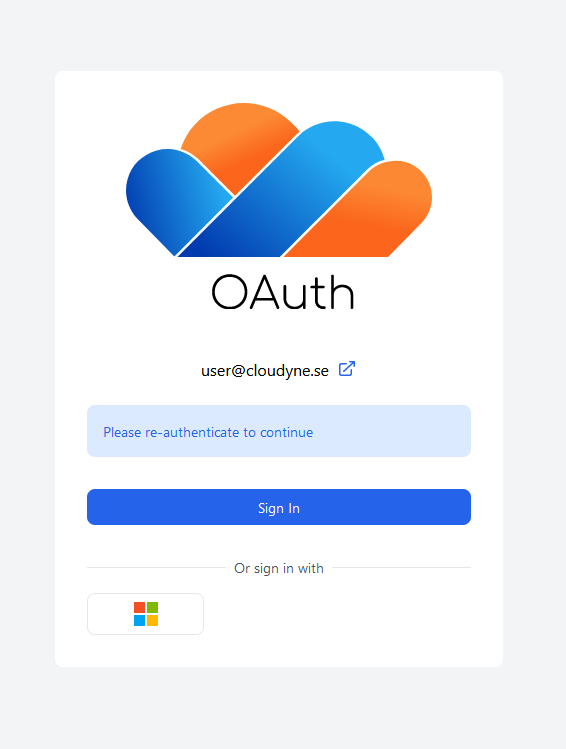
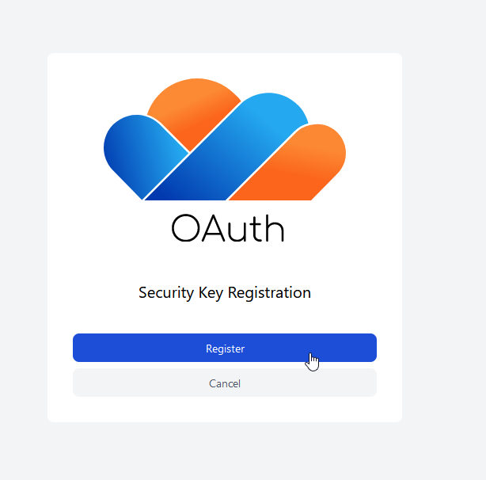
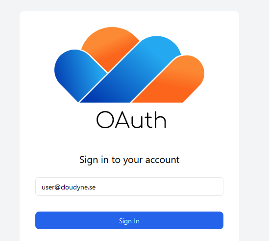
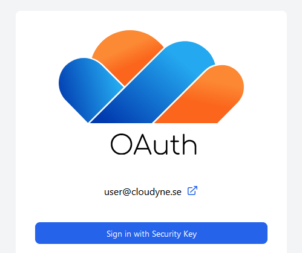

## Use Microsoft 365
Go to your wp-admin (https://site.com/wp/wp-admin/) and click on the Wordpress logo with the cloud. If your logo does not have a cloud, SSO is not enabled for your website and you need to contact us to get it activated.

You'll be redirected to our IDP for authentication.

Click on the Microsoft 365 flag at the bottom to log in with your Microsoft 365 account.

## Use a passkey
Passkeys are a relatively new and secure way to sign in to websites. Start by going to [https://oauth.se](https://oauth.se/realms/master/account/#/) and log in with your Microsoft 365 account. Then, click Account Security => Signing in

You can then create a passkey by clicking on "Set up Security Key" under the Passwordless-section. You will need to either have a hardware key, or another device/software capable of storing passkeys to set this up, this should work natively with iOs and Android.

Once clicked, follow the instructions to set up your passkey. You might have to sign in again to confirm your identity before creating the passkey, use the Microsoft 365 login for this.

Then, click the "Register" button and follow your on-screen instructions to create a passkey.

The next time your are at the OAuth login screen, you can type in your email address and then click "Sign in with Passkey" to use your passkey to sign in.

## Using Swedish BankID
You can also connect a Swedish BankID to your account. More information about this is coming fall 2024.